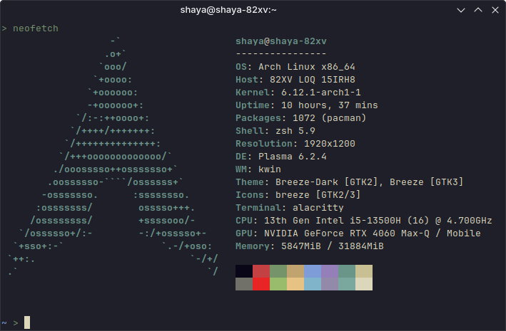

  

# Shaya's Personal Configs
## Installation
* Clone repo and move .config into your home directory

## ZSH
* Install oh-my-zsh: `sh -c "$(curl -fsSL https://raw.githubusercontent.com/ohmyzsh/ohmyzsh/master/tools/install.sh)"`
* Install [PowerLevel10K](https://github.com/romkatv/powerlevel10k) `yay -S --noconfirm zsh-theme-powerlevel10k-git
echo 'source /usr/share/zsh-theme-powerlevel10k/powerlevel10k.zsh-theme' >>~/.zshrc`
* For clean configuration use `p10k configure` > (`~/.p10k.zsh`)
* Install Auto Suggestions: `git clone https://github.com/zsh-users/zsh-autosuggestions ${ZSH_CUSTOM:-~/.oh-my-zsh/custom}/plugins/zsh-autosuggestions`
* Install Syntax Highlighting: `git clone https://github.com/zsh-users/zsh-syntax-highlighting.git ${ZSH_CUSTOM:-~/.oh-my-zsh/custom}/plugins/zsh-syntax-highlighting`

## Godot
* Install [Minimal Theme](https://github.com/passivestar/godot-minimal-theme)
