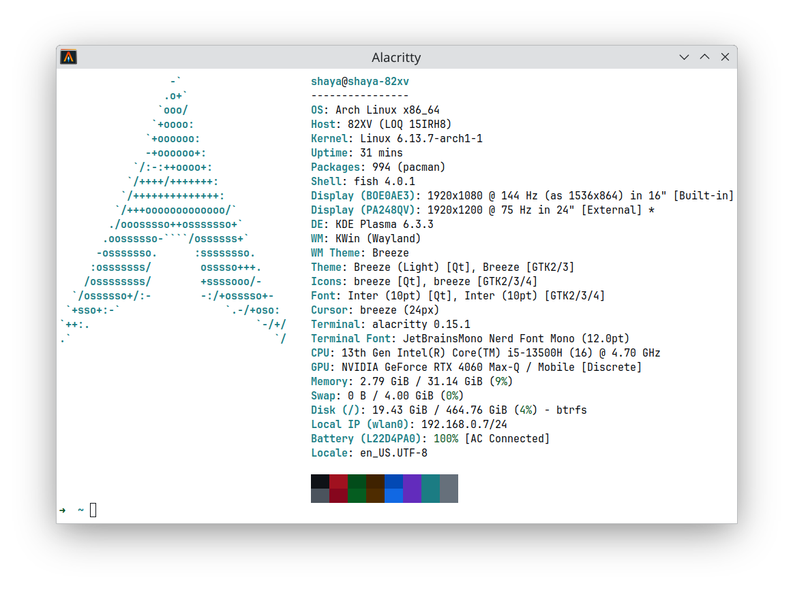

<p align="center">
  
</p>

# Shaya's Personal Configs
Collection of personal configs and editor settings for fish, Alacritty, VSCode and Godot.
Clone repo and move .config into home directory.

### fish
Install fish ```$ yay -S fish```, set it as default shell ```$ chsh -s /usr/bin/fish``` and reboot.
### code
Select User or _User config, for light or kanagawa wave environment.
